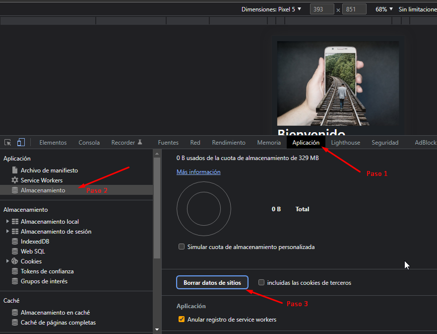

# CursoPWA "Curso para el manejo de aplicaciones web progresivas"

**Profesor** 


**Enlaces:**

- https://www.udemy.com/course/aplicaciones-web-progresivas/


## Sección 1: Fundamentos que debes tener ya instalados 


Visual Studio Code Extensiones
Estas son las extensiones que estoy usando en Visual Studio Code. 

Importer.
• Angular 6 Snippets - TypeScript, Html, Angular Material, ngRx, RxJS & Flex Layout
• Angular Language Service
• angular2-inline
• Bootstrap 4, Font awesome 4, Font Awesome 5 Free & Pro snippets
• HTML CSS Support
• Ionic 3 snippets
• JavaScript (ES6) code snippets
• jshint
• JSON to TS
• Material Icon Theme
• mysql-inline-decorator
• Prettier - Code formatter
• PWA Tools
• Terminal
• TSLint
• TypeScript Importer


## Sección 2: Fundamentos de las aplicaciones web progresivas

**¿Qué son las aplicaciones web progresivas?**

> Son:
- Son Mobile Firts
- Es pensando para celulares 
- Es un aplicacion web, que puede ser una pagina web 
- Funciona sin conexion web 
- Usa aplicaciones nativas del dispositivo 
- Es confiable  - Esta actualizada - Carga muy rapido. 
- No se le pregunta al usuario si se desea actulizar o no. 
- Ejemplo la PWA de twiter pesa menos que la APP nativa 


>No es: 
- No es una extension de navegadores web 
- No es un Framework como React, Vue, angular
- No es un pluging o libreria para los frameworks
- No es parecido a React Native, Native script, ionic 
- No es responsive 
- No es una aplicación nativa 

**¿Por qué construir una PWA??**

**Razones:**
- Muchos usuarios usan su celular mobil para validar o revisar su navegador web del celular para ver tu sitio web 
- La tendencias es que las personas estan usando mucho el navegador web del celular 
- El usuario promedio instala 0 aplicaciones nativas por mes. 
- El usuario promedio primero busca en el navegador web antes de descrgar una app nativa 
- Las PWA tiene la ventaja de correr sin conexión 
- las PWA tienen el poder de (Push Server, Manifest, IndexedBD, Service Worker)

**¿Conceptos Clave de las PWA??**

**Service Worker**
- Es un pequeño proxy que esta entre nuestra pagina web y el WWW
- Es un arhivo JS plano 
- Cuando nuestra pagina realiza una petición a la WWW pasa por nustro archivo JS (Service Worker) y decide lo que podemos realizar con conexión o sin conexion 
- Debe estar siempre bajo un protocolo HTTPS
- Forma Operacional -> si nos conectamos a la web pasa por el **service worker**  esta valida si existe el elemento en su localstorage si existe la muestra en la web si no se conecta a la web la baja la guarda en local y la muestra. 
- El service worker inicia con el `navigator.serviceWirker.register(/sw.js)`
- El **SW** Corre en hilos independientes si cierras tu pagina que estas consultando este no se termina sigue escuchando para estar listo de nuevo para tu web 
- Ciclo de Vida, Instalando -> Instalado -> Activación -> activado -> Ocioso 


- Paso Instalando: Se descarga el archivo JS, el JS es parseado o revisado paso al siguiente paso 
- Paso Instalado: Se conoce como waiting, Se movera el siguiente paso si no existe algun SW ejecutandose en caso que exista otro SW ejecutandose el solo esperará que todos los tab esten cerrados para ejecutarse
- Paso Activación: susede antes que el SW  tome el control de nuestra aplicación, aqui podemos hacer alguna limpieza en caso que se necesite.
- Paso activado: Cuando esta activo aqui el SW tiene control absoluto de nuestra aplicación we, control total de lo que deseamos hacer. 
- Paso Ocioso: esto es cuando falla la instalación ó es reemplazado por otro SW, ya no hay control de la aplicación, solo esta esperando para ser destruido. 

## Sección 3: Reforzamiento Promesas, Fetch API y HttpServer

**Puntos**
- Promesas
- Promesas en cadena
- Promise.all
- Promise.race
- Fetch API
- Gets
- Posts
- Fetch de Blobs
- http-server

### Clase 13 Reforzamiento Promesas, Fetch API y Httserver 

Podemos instalar `npm install http-server -g` para que podamos ejecutar en un server pero podemos usar Go Live un plugin de visual 

>PD : 

- Para generar una promesa 
```
const sumar =( num)=>{

    var promesa = new Promise( (resolve, reject)=>{
            setTimeout(() => {
                resolve(num + 1 );  
            }, 800);
   });

   return promesa;
}

sumar(9).then( (nuevoNumero)=>{
    console.log(nuevoNumero);
} ); // has esto cuando la promesa termine, no dispara la promesa  

console.log("Aqui promesa manejando error");

const sumar =( num)=>{

    var promesa = new Promise( (resolve, reject)=>{
            console.log(num);
            if (num >= 7){
                reject('El numero es muy alto');
            }
            setTimeout(() => {
                resolve(num + 1 );  
            }, 800);
   });

   return promesa;
}

sumar(3).then( sumar )
        .then( sumar )
        .then( sumar )        
        .catch(error =>{
         console.log(`Error:>`, error);   
        });
```
https://developer.mozilla.org/es/docs/Web/JavaScript/Reference/Global_Objects/Promise/race
https://developer.mozilla.org/es/docs/Web/JavaScript/Reference/Global_Objects/Promise/all

## Sección 3: Origenes del Fetch Clase 22


**Petición Fetch Nueva **
```

fetch('https://reqres.in/api/users')
	.then(resp=>{
	//Esto es una promesa tambien
	let valor = resp.json().then();
	console.log(valor);
});

```
## Sección 4: Service Worker y Fetch Event 

## Clase 34: Introducción al service worker 

**Que és**
- Es un mediador que tiene la función de validar todas la peticiones antes de entrar o establecer una conexcion a la web. 
- Service corre en su backgorund, corre en su propio hilo. 
- Recuerda a pesar que cierres el navegador el servicewroker siempre queda activo. 
- Se identifica en el navegador por tener un engranaje como icono
- Es un archivo normal js, lo diferencia de los demas porque tiene un gran conjunto de eventListener, esta pendiente de sucesos. 
- Podemos disparar eventos para install, active, push, fetch, sync, message. 
- Siempre se debe ejecutar en una ruta segura si no, no funciona es decir conexiones HTTPS://


## Clase 35: Inicio del Proyecto 

**Consejos**
- Siempre debemos limpiar cache para manejar los service worker




## Clase 36: Instalacion del Service Worker

**Consejos**
> Paso 1:
- Debes usar algun servidor para usar SW, yo ando usando un plugin de Visual Code llamado `Live Server`, pero puedes usar Laragon o otro servidor apache que tengas disponible 
- Debemos validar que version que navegador web soporta service worker 
- https://caniuse.com/?search=service%20worker 
  
> Paso 2:  
- Los SW siempre van en la raiz de los proyectos 
- Podemos referencias nuestro SW de esta manera `navigator.serviceWorker.register('sw.js');`
- Claro previamente debemos crear nuestro archivo `sw.js` en raiz recuerda en raiz de TU proyecto. 
- Nota se genera en la raíz ya que con este, le estamos diciendo que tome control absoluto de todos los archivos y carpetas que tienen nuestro proyecto. 
  

> Paso 3:  
-


## Clase 37: Como hacer un escuchador 

```
 self.addEventListener('fetch', event=>{
    console.log(event);
})
```


## Sección 5: Ciclo de vida de un Service Worker y los listeners más comunes

**Temas puntuales de la sección**


> Esta sección tiene un resumen de los principales listeners usado dentro de un service worker, mi objetivo es enseñarles cómo y en qué momento son invocados para posteriormente utilizarlos en una aplicación que desarrollaremos que requiere estos conocimientos.

**Entre los listeners más comunes están:**

- fetch
- sync
- install
- activate
- push

## Clase 47. Service Worker: Install


Forma de instalar un SW
```

// Detectar si podemos usar Service Workers
if ( navigator.serviceWorker ) {
    navigator.serviceWorker.register('./sw03.js');
}
```

> Nota: Si ves que no jala la instalción cierra el navegaor o abre otro navegador y sigue con la practica

## Clase 48-51:

```
// Ciclo de vida del SW

//install
self.addEventListener('install', event=>{

    //Durante la Instalación del SW 
    //Descargar Assets 
    // Creamos un Cache
    console.log("SW: Instalando SW");

    //self.skipWaiting(); // 
const instalacion = new Promise((resolve, reject) =>{
    setTimeout(() => {
        console.log("SW: Instalaciones terminadas");
        self.skipWaiting();
        resolve();
    }, 2000);

});

    //Esto permite esperar que hasta la promesa termine    
    // Siempre resive promesas 
    event.waitUntil(instalacion); 

3});

//Cuando el SQ toma el control de la aplicación.
//activate
self.addEventListener('activate', event=>{
    console.log('SW: activo y listo para controlar app');

});

//FETCH: Manejo de peticiones http 
self.addEventListener('fetch', event=>{
    //Aplicar estrategias del cache 
    //Hay que preguntarnos vale la pena guardar cache 
    console.log('SW: '+ event.request.url);
    if (event.request.url.includes('body')){
        const resp = new Response(`mensaje jajaa`);
    }
});


//SYNC: LO USAMOS CUANDO RECUPERAMOS CONEXION A INTENER 
// se combina el index del navegador y validar el tag 
// Tenemos que validar si el navegador soporta esta funcionalidad 
self.addEventListener('sync', event=>{

    console.log("SW: Tenemos conexión");
    console.log(event);
    console.log(event.tag); 

});

```
## Clases 58: introducción al cache storage 

> El cache es un espacio de disco duro, podremos crear variables y anxar cualquier valor 


**Meotodos básicos**
-  caches.open
-  caches.has
-  caches.delete
-  cache.add
-  cache.addAll
-  cache.match
-  caches.keys


**Nota**
- La funcionalidad `Cache` es propia de windows 
- La funcionalidad `server worker` es del navegador 
- Al consultar cache se convierte en una promesa por lo que podemos usar .then 
- Puedo almacenar imagenes, estilos, js, paginas web. 


**Ejemplos**

```
//Validamos SI EL NAVEGADOR SOPORTA caches 
if (window.caches){
    //Asi creamos Cache 
    console.log("Creando caches");
    caches.open('prueba-1');

    //Asi valido si existe dicha chache 
    if (caches.has('prueba-1')){
        console.log("valido caches");
        caches.has('prueba-1').then(console.log);
    }

    //Asi elimino cache
    console.log("elimino caches"); 
    caches.delete('prueba-1');

    //Asi agrego  valores a la cache
    cache.add('../template/404.html');

}

// Crear caches multiples 
    caches.open('cache-v1.1').then(cache =>{
        //Tambien es una promesa
        cache.addAll(
            ['../template/404.html',
            '../css/style.css',
            '../img/offline.gif'
            ]).then(()=>{
                //Puedo meter operaciones aqui 
                caches.delete('../css/style.css');
                cache.put('../template/404.html', new Response('Hola mundo')); // Asi se remplaza
            });

            // es otra promesa
            cache.match('../template/404.html').then(resp =>{

                resp.text().then(console.log);
            });
    });

    //Forma de validar que caches existen 
    //Es un trabajo asincrono
    caches.keys().then(keys =>{

        console.log(keys);
    })

```
http://127.0.0.1:5500/Proyectos/04-cache-offline/


## Clases 59. Guardar el APP SHELL a la hora de instalar SW

**APP SHELL**
> Es un metodo que nos ayuda a validar que se necesita instalar para que tu apalicion pueda trabajar, es algo que deseo cargar rapidanmente 

## Clases 60. Estrategia: Cache Only

> Una ves instanciado el unico cache, la idea es que jamas regrese a consultar algo a la web 
> Esta es usada cuando toda la aplicación es servida desde el unico cache, no va existir peticion que aceda a la web.  

**Ejemplo**
```
//Iniciamos Instaladore 
self.addEventListener('install', event=>{
    
    const cacheProm = caches.open('cache-1').then(cache =>{
        return cache.addAll([
            '/'
            ,'./template/404.html'
            , './css/style.css'
            , './img/main.jpg'
            , 'https://stackpath.bootstrapcdn.com/bootstrap/4.1.3/css/bootstrap.min.css'
            , './js/app.js'
            , './index.html'
        ]);

    });

    //Debemos esperar que se termine 
    event.waitUntil(cacheProm);

});


//Iniciamos con método fecth

self.addEventListener('fetch', event=>{


    //Estrategia del cache 
    //cache Only 
    event.respondWith( caches.match( event.request) ); 

    
});

``` 

## Clases 61. Estrategia: Cache with network fallback


**Nota**
- Esta estrategia es algo complicada ya que si existe un error 404 validando cache no lo puedo cath con un try 
- No estan optima ya que se mezcla logica de programación con tus propios metodos originales 


**Ejemplo**
```


//Declaro variables
const CACHE_NAME = 'cache-1'; 


//Iniciamos Instaladore 
self.addEventListener('install', event=>{
    
    const cacheProm = caches.open(CACHE_NAME).then(cache =>{
        return cache.addAll([
            '/'
            ,'./template/404.html'
            , './css/style.css'
            , './img/main.jpg'
            , 'https://stackpath.bootstrapcdn.com/bootstrap/4.1.3/css/bootstrap.min.css'
            , './js/app.js'
            , './index.html'
        ]);

    });

    //Debemos esperar que se termine 
    event.waitUntil(cacheProm);

});


//Iniciamos con método fecth

self.addEventListener('fetch', event=>{

    //Estrategia 
    // Cache with network fallback
    const respuesta = caches.match( event.request).then( resp =>{
        
        //Si todo bien
        if (resp) return resp;

        //Si todo mal, debo conectarme a la web 
        console.log("No Existe", event.request.url);


        return fetch( event.request ).then( newResp => {
            caches.open(CACHE_NAME)
                .then(cache =>{
                    cache.put( event.request, newResp );
            });
            return newResp.clone();

        });

    });

    event.respondWith(respuesta);

    
});


```

## 62. Cache dinámico - Optimizaciones

**Nota**
- Nos permite crear caches mas mantenibles en el tiempo debido que las segmentamos
- Podemos manera una cache dinamica pero hay que limitarla ya que no podemos colocar todo lo de la nube en esa cache 

```

//Declaro variables

//Metemos las variables que son corazon de nuestra aplicación y solo se usa cuando se instala wl ws
const CACHE_STATIC_NAME = 'static-v1'; 

//Metemos valores que cambian de forma muy recurrente, puede crecer mucho por eso lo separamos
const CACHE_DYMAMIC_NAME = 'dynamic-v1'; 

//Metemos valores que no cambian en el tiempo 
const CACHE_INMUTABLE_NAME = 'inmutable-v1'; 


//Iniciamos Instaladore 
self.addEventListener('install', event=>{
    
    const cacheProm = caches.open(CACHE_STATIC_NAME)
    .then(cache =>{
       
        return cache.addAll([
            '/',
            './template/404.html',
            './css/style.css',
            './img/main.jpg',
            './js/app.js',
            './index.html'
        ]);

    });

    const cacheInmutable = caches.open(CACHE_INMUTABLE_NAME).then(cache => cache.add('https://stackpath.bootstrapcdn.com/bootstrap/4.1.3/css/bootstrap.min.css'));     

    //Debemos esperar que se termine 
    event.waitUntil( Promise.all([cacheProm, cacheInmutable]) );

});


//Iniciamos con método fecth

self.addEventListener('fetch', event=>{

    //Estrategia 
    // Cache with network fallback
    const respuesta = caches.match( event.request)
    .then( resp =>{
        
        //Si todo bien
        if (resp) return resp;

        //Si todo mal, debo conectarme a la web 
        console.log("No Existe", event.request.url);


        return fetch( event.request ).then( newResp => {
            caches.open(CACHE_DYMAMIC_NAME)
                .then(cache =>{
                    cache.put( event.request, newResp );
            });
            return newResp.clone();

        });

    });

    event.respondWith(respuesta);

    
});

```


## 63. Limitar el cache dinámico

**Nota**


```

//Declaro variables

//Metemos las variables que son corazon de nuestra aplicación y solo se usa cuando se instala wl ws
const CACHE_STATIC_NAME = 'static-v2'; 

//Metemos valores que cambian de forma muy recurrente, puede crecer mucho por eso lo separamos
const CACHE_DYMAMIC_NAME = 'dynamic-v1'; 

//Metemos valores que no cambian en el tiempo 
const CACHE_INMUTABLE_NAME = 'inmutable-v1'; 


function limpiarCache( cacheName, numeroItems ){

    caches.open(cacheName)
    .then( cache =>{
        return cache.keys()
            .then(keys =>{
                console.log(keys);
                if (keys.length > numeroItems ){
                    //Lo vuelve recursivo
                    cache.delete(keys[0]).then(limpiarCache(cacheName, numeroItems));
                }

        });

    });

}

//Iniciamos Instaladore 
self.addEventListener('install', event=>{
    
    const cacheProm = caches.open(CACHE_STATIC_NAME)
    .then(cache =>{
       
        return cache.addAll([
            '/',
            './template/404.html',
            './css/style.css',
            './img/main.jpg',
            './js/app.js',
            './index.html'
        ]);

    });

    const cacheInmutable = caches.open(CACHE_INMUTABLE_NAME).then(cache => cache.add('https://stackpath.bootstrapcdn.com/bootstrap/4.1.3/css/bootstrap.min.css'));     

    //Debemos esperar que se termine 
    event.waitUntil( Promise.all([cacheProm, cacheInmutable]) );

});


//Iniciamos con método fecth

self.addEventListener('fetch', event=>{

    //Estrategia 
    // Cache with network fallback
    const respuesta = caches.match( event.request)
    .then( resp =>{
        
        //Si todo bien
        if (resp) return resp;

        //Si todo mal, debo conectarme a la web 
        console.log("No Existe", event.request.url);


        return fetch( event.request ).then( newResp => {
            caches.open(CACHE_DYMAMIC_NAME)
                .then(cache =>{
                    cache.put( event.request, newResp );
                    //Buen Lugar para limpiar el cache 
                    limpiarCache(CACHE_DYMAMIC_NAME, 3);
            });
            return newResp.clone();

        });

    });

    event.respondWith(respuesta);

    
});

```


##  64. Estrategia: Network with cache fallback

**Nota**
- Si usamos dispositivos mobiles siempre siempre va consultar algo de la nube 
- Es mas lenta por lo que la estrategia pudiera fallar con conexiones 2g 3g 

```
self.addEventListener('fetch', event=>{

    //Estrategia  3- Network with cache fallback
    // Si usamos dispositivos mobiles siempre siempre va consultar algo de la nube 
    //Es mas lenta por lo que la estrategia pudiera fallar con conexiones 2g 3g 
   
   if (!res){
        return caches.match(event.request);//Esto es como un ultimo recurso 
   }
    const respuesta = fetch(event.request).then(res =>{

        caches.open(CACHE_DYMAMIC_NAME)
            .then(cache => {
                    cache.put(event.request, res);
                    limpiarCache(CACHE_DYMAMIC_NAME, CACHE_DYMAMIC_LIMIT);
            });

        return res.clone();

    }).catch(err=>{
        return caches.match(event.request);
    });
    
    //Aqui permite pasar nuestra promesa 
    event.respondWith(respuesta);

    
});
```

##  65. Estrategia: Cache with network update

**Nota**
- Se usa cuando necesitamos un rendimiento exigente 
- Nuestra app estara un paso atras de la versio original 
- En esta estrategia se supone que toda la información existe en la cache no se tiene nunguna cache que sea dinamica
- Se retorna el producto obtenido en se actualiza la cache 

```
self.addEventListener('fetch', event=>{

    if (event.request.url.includes('bootstrap')){
       return  event.respondWith(caches.match(event.request));
    }
    
    //Estrategia  4- Cache with network update
    const respuesta = caches.open(CACHE_STATIC_NAME).then(cache => {

        fetch(event.request).then( newResp =>{//Hacemos pesto para obtener la ultima version del host 
            //Aqui actualizó de nuevo la cache con lo que se regesa
            cache.put(event.request, newResp);
            
            return cache.match(event.request);//Se actuliza de nuevo la cache
        });

    });
    
    //Aqui permite pasar nuestra promesa 
    event.respondWith(respuesta);

    
});

```


##  66. Estrategia: Cache & Network Race 

**Nota**
- Es una competencia para ver cual de los dos responde primero 
- Es para aquellos dispositivos que tenga un procesamiento de cache lento pero una velocidad de internet rapida 
- Es para darle al usuario la mas alta velocidad de respuesta en estas peticiones 

```
self.addEventListener('fetch', event=>{

    const respuesta = new Promise( (resolve, reject)=>{
        let rechazada = false; 

        const falloUnaVez = ()=>{
            if (rechazada){
                //No existe en el cache ni una respuesta valida  
                if (/\.(png|jpg)$/i.test(event.request) ){
                    //si entra a este codnicional debo retornar una imagen 
                    resolve(caches.match('./Proyectos/04-cache-offline/img/no-image.jpg'));
                }else{
                    //Podemos crear y decir que esta pagina web no se encontro
                    reject('No se encontro respuesta');
                }
            }else{
                rechazada = true;
            }

        };

        fetch(event.request).then( resp=>{
            //Recuerda que el fetch puede fallar por el 404 
            resp.ok ? resolve(resp): falloUnaVez();

        }).catch(error=>{
            falloUnaVez();
        });

        caches.match(event.request).then(resp =>{

            resp ? resolve(resp) : falloUnaVez();
        
        }).catch(falloUnaVez);

    });
    
    //Aqui permite pasar nuestra promesa 
    event.respondWith(respuesta);
    
});
```

##  67 y 68 y 69 . Estrategia combinadas
**Nota**
- Podemos usas estrategias para definir nuestro pwa todo depende de la logica del negocio o lo que requieres
- `if (e.request.headers.get('accept').includes('text/html')){` podemos usar esta estrategia para validar un html, css, js lo que venga de request 

## 70 - 71 

**Resultados Cuestionarios**


## Seccion 7 - Despliegues a disposivos 

**Resumen**


## Clase 72-73-74-75-76-77-78

**Nota**
- El Master nos comparte ya una herramienta de chat creada funcional el proposito es pasarla PWA
- Aqui aplicaremos las nociones basicas aprendidas y pequeños tips para empezar desarrollar PWA 
- No logro solventar problemas del cors usando los eventos he estado leyendo esto sin exito -> https://developer.chrome.com/blog/foreign-fetch/

**Ejemplo**
- El proyecto [Chat Vengadores](Proyectos\05-twittor)

**Resumen**
- Paso 1: Creamos nuestro archivo ws.js 
- Paso 2: En nuestro app.js creamos el enlace con el ws.js creado PD-> recuerda que tu app.js es tu archivo js que arranca alguna funcionalidad de tu apliación para este ejemplo este archivo esta en js/app.js 
- Paso 3: ya arrancamos a la configuración del WS 
  - Paso 3.1: Creamos nuestras variables caches
  - Paos 3.2: creamos nuestro evento instalador  
  - Paos 3.3: creamos nuestro evento activate
  - Paos 3.4: creamos nuestro evento fetch

- Paso 4: Creamos nuestro Manifest.json 
  - Paso 4.1: Debemos crear el archivo manifest y configurarlo [Manifest](https://web.dev/add-manifest/)
  - Paso 4.2: debemos colocar esto en cada página html o plantilla que usemos`<link rel="manifest" href="manifest.json"/>` 
**Ejemplo  Manifest validado**
!Manifest[](info/ManifestComprobado.png)


```
```

## Seccion 8 - IndexedDB - Reforzamiento de base de datos local

**Resumen**


## Clase 89- Inicios de indexedDB
**Nota**
- Cuando modificamos cualquier cosa de la base de datos debemos manejar todos los request y todos los listenes de manera manual. 
- 

**Ejemplo**
```
// indexedDB: Reforzamiento
let request = window.indexedDB.open('mi-database', 1);

//Se actualiza cuando se crea o se sube una nueva version de la DB 

request.onupgradeneeded = event =>{

    console.log('Actualiza DB');
    let db = event.target.result; //Referencia a la BD 

    //Necesitamos una key para nuestra BD 
    db.createObjectStore('heroes', {
        keyPath:'id'

    });

};

```

**Enlace**
- https://developer.mozilla.org/es/docs/Web/API/IndexedDB_API


## Clase 90 - Manejo de errrores 
**Nota**
- Es complejo ya que se debe manejar por eventos
- se pierde organización del código
- no es seguro y no es facil de mantener
  
**Interfaz**
- 

**Ejemplo**
- [Ejemplo](Proyectos/07-indexeddb/app.js)

## Clase 92 - PouchDB- Empesando 
**Nota**
- PouchDB es una base de datos de JS, que nos permitirá grabar información durante el offline y luego conectarnos y sincronizarlo con otra base de datos en un servidor. 
- Es un Plugin que trabaja a base de promesas 

**Info**
- [Tuto](info/Getting+Started+Guide.pdf)
- https://pouchdb.com/getting-started.html

**Como**
- Paso 1: Configuramos en el index.html o el archivo principal el la libreria DNS 
- Anexamos esto en la parte inferior `<script src="//cdn.jsdelivr.net/npm/pouchdb@7.3.0/dist/pouchdb.min.js"></script>`
- Paso 2: Creamos la base de Datos JS en el `app.js`

```
var db = new PouchDB('todos');
var remoteCouch = false;
```
- Paso 3: Creamos el metodo para insertar 
```
  // We have to create a new todo document and enter it in the database
  function addTodo(text) {
    var todo = {
      _id: new Date().toISOString(),
      title: text,
      completed: false
    };
    db.put(todo, function callback(err, result) {
      if (!err) {
        console.log('Successfully posted a todo!');
      }
    });    
  }

```

## Podemos generar un CRUD de la sigueinte manera. 
```

  //CREAR
  // We have to create a new todo document and enter it in the database
  function addTodo(text) {
    var todo = {
      _id: new Date().toISOString(),
      title: text,
      completed: false
    };
    
    //Forma callback
    
    db.put(todo, function callback(err, result) {
      if (!err) {
        console.log('Successfully posted a todo!');
      }
    });
    

    //Forma Promesa
    /*db.put(todo)
      .then( console.log('Insertado') )    
      .catch( console.log );
      */
  }

  //Mostrar 

    // Show the current list of todos by reading them from the database
  function showTodos() {

    
    //Forma call back
    /*db.allDocs({include_docs: true, descending: true}, function(err, doc) {
      redrawTodosUI(doc.rows);
    });
    */

    //Forma de promesa
    db.allDocs({include_docs: true, descending: true})
    .then(doc =>{
      redrawTodosUI(doc.rows);
    });

  }

//Editar


  function todoBlurred(todo, event) {

    var trimmedText = event.target.value.trim();
    if (!trimmedText) {
      db.remove(todo);
    } else {
      todo.title = trimmedText;
      db.put(todo);
    }    
  }

//actualizar
    function checkboxChanged(todo, event) {

    todo.completed = event.target.checked;
    db.put(todo).then(console.log('Registro actualizado'));    
  }

  //Eliminar
  // User pressed the delete button for a todo, delete it
  function deleteButtonPressed(todo) {
    db.remove(todo).then(console.log('Registro Eliminado'));
  }

```